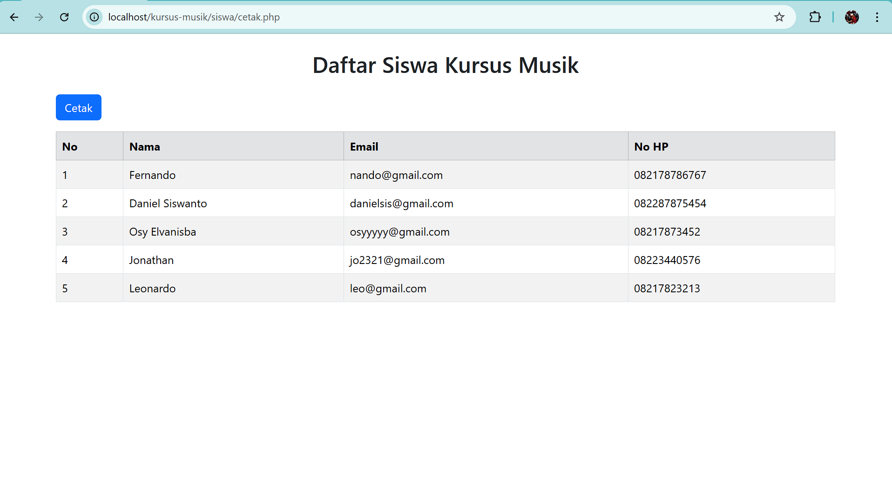

# 🎵 Aplikasi Web Kursus Musik - Jef Boy

## 📌 Deskripsi Proyek

Aplikasi ini adalah sistem manajemen kursus musik berbasis web yang menyediakan fitur untuk mengelola data siswa, kursus, login admin, serta cetak laporan dalam format PDF. Aplikasi dirancang dengan tampilan yang menarik dan modern menggunakan Bootstrap 5.

## ⚙️ Teknologi yang Digunakan

- PHP Native (tanpa framework)
- MySQL Database
- Bootstrap 5.3 (teknologi terbaru)
- HTML5 & CSS3
- JavaScript (validasi form)
- Browser Print-to-PDF (untuk cetak laporan data siswa)

## 🌟 Fitur Utama dan Tambahan

- Login Admin
- Manajemen data siswa (CRUD)
- Manajemen data kursus (CRUD)
- Dashboard dengan statistik total siswa & kursus
- Tampilan elegan dan responsif (Bootstrap 5)
- Header & footer konsisten di semua halaman
- Cetak laporan PDF (manual print & versi otomatis)
- Validasi form input

## ▶️ Cara Menjalankan Aplikasi

1. Clone atau download repositori ini ke folder `htdocs` (jika menggunakan XAMPP).
2. Import file database (`db_kursus.sql`) ke phpMyAdmin.
3. Atur koneksi database di file `config/db.php`.
4. Jalankan aplikasi melalui browser: http://localhost/kursus-musik/
5. Login menggunakan akun 
    username : jef
    password : 123456

## 🖼️ Screenshot Aplikasi

## ini juga sudah di hosting
## akses juga bisa melalui link dibawah ini :

        vvvvvvvvvvvvvvvvvvvvvvvvvvvvvvvvvvvvv
        https://jefboycourse.jagoankode.my.id/